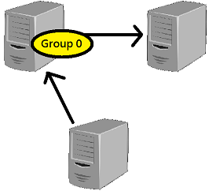

# NASA 2017 Final Project - NFS 伺服器靜態負載平衡
## 組員
* 資工一 b05902086 周逸  
* 資工二 b04902112 張凱捷  
* 資工一 b05902092 謝耀慶  
* 資工一 b05902093 顏睿楠  
## 題目敘述
## 系統簡介
* Autofs
* Hash function
* Moving files
## 實作過程
* Hash function
    * A balanced lookup table
    * Auto balance itself when groups or machines are added/removed
    * balanced backup (load are still balanced when some machines are down)
    * Minimize the transfer needed
    * Minimize the groups affected when two (or more) machines are down (a direct benefit from balanced backup)
    * Theoretically can have infinite numbers of groups or machines (no fixed-sized data structure used in the implementation)
* Moving files  
    當要把一個group從B機器搬到C機器時，相較於把B機器跟C機器的檔案直接mount在一台中央控制A機器上後再搬移檔案，我們使用直接移動的方式，也直接在B機器上把C機器上檔案mount上去後，再把資料搬過去。這樣可以讓資料不會需要全部都通過A機器後再到達目的地，也能減少約一半的網路開銷。  
    
      
    我們使用了兩種不同的方式來時做這個過程來移動檔案  
    * By NFS bootstrap
        * Service
        * 
    * By SSH
        * move group0 from nfs1 to nfs2
        ```
        ssh root@nfs1 “./movefile nfs2 group0”
        ```
        * add group0 to nfs1
        ```
        ssh root@nfs1 “mkdir /var/nfs/group0”
        ```
        * remove group0 from nfs1
        ```
        ssh root@nfs1 “rm -rf /var/nfs/group0”
        ```
        * movefile.sh
        ```
        ip=$1
        dir=$2
        mount -t nfs $ip:/var/nfs /mnt/$ip
        cp -rf /var/nfs/$dir /mnt/$ip
        umount /mnt/$ip
        ```
* DNS
    * NFS server 由 autofs 經過 DNS server 連結，於是可以做到多一層備援
## 遇到的困難
## 未來的可能性
* 把各組別的人數和優先權納入平衡附載的考量
* 目前搬移使用者會需要將所有使用者登出(因為要重啟autofs),但可以做到只把要搬移的使用者登出就好
* 最好是能做到完全沒有down time的搬移(等使用者自己登出，下次登入就會在新的機器上)，但是autofs不支援
## 分工
 
 
 
 
