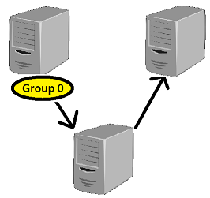

# NASA 2017 Final Project - NFS 伺服器靜態負載平衡
## Github Location
* [https://github.com/qazwsxedcrfvtg14/NASA/tree/master/Final](https://github.com/qazwsxedcrfvtg14/NASA/tree/master/Final)
## 組員
* 資工一 b05902086 周逸  
* 資工二 b04902112 張凱捷  
* 資工一 b05902093 顏睿楠  
* 資工一 b05902092 謝耀慶  
## 題目敘述  
* 因為系上的目前只有一台 NFS Server，當如果有使用者在NFS掛載目錄上執行大量 IO 操作時，就會發現整個所有工作站都變得非常的卡，這時如果有辦法讓使用者分流，就至少不會所有人都會因為那個不良行為的人而上不去工作站。  
* NFS 備援的用處則是當如果你很不幸地和那個不良行為的人都需要存取同台 NFS Server 時，如果連不上去，至少還可以透過備援的方式能使用最久一天前的資料，也不會因此而無法使用工作站的其他資源。  
* 為了解決上述的各種問題，因此我們決定寫一套系統可以讓管理者能夠方便的增加和移除使用者群組，也能方便的增加和減少 NFS Server。
## 系統簡介
* Structure  
    我們這個系統的架構是由一台 DNS Server、一台 NFS Master Server、多台 NFS Server 和多台 Client 所組成。
    * DNS Server  
        一台控制域名用的機器，這台機器可以讓發生緊急意外的時能將其他機器所對應到的域名對應到其他地方。  
        並且能讓管理系統的人不需要去直接把每一台機器的IP直接記起來。  
    * NFS Master Server  
        一台存放著各台系統和 NFS 負載相關設定檔的位置，但是當這台機器故障時就需要透過DNS將指向這台機器的域名換到其他機器上。  
        而管理員要操作各項關於 NFS 負載平衡的設定時，也只要在這台機器上操作即可。  
        而且這台機器也能身兼 NFS Server。  
    * NFS Server  
        存放著使用者資料的機器，會在開機時自動掛載 NFS Master Server 上的設定檔目錄，藉此來達成中央控管功能。  
    * Client  
        會在開機時自動掛載 NFS Master Server 上的設定檔目錄，透過這樣當方式得到 autofs 的設定目錄，並且取得NFS備援機器的位置。  
        也能藉由這樣的方式在當管理員變更 NFS 負載平衡設定時就能自動地把使用者的目錄重新掛載(但不會中斷使用者的連線)。  
* Hash function  
    這是一個給管理員使用的程式，管理員可以透過執行他並加上參數達成調整 NFS 靜態負載目的。  
    而其有提供以下的功能  
    * 初始化
    * 增加&刪除群組
    * 增加&刪除機器
    其具有以下性質
    * 平均分佈負載
    * 平均分佈備援
    * 多台以上的機器故障時，完全無服務的群組數最小
    * 增刪機器時，最小化搬移的群組數
* Moving files  
    當使用 Hash function 將群組和機器之間對應修改後，我們可能會需要將一些群組的檔案在不同的機器上做搬移。  
* Auto backup files  
    每天會固定在半夜四點的時候自動把NFS之間的檔案同步，使備援資料不會過時太久，也比較不會占用尖峰時間的系統資源。
## 實作過程
* Structure  
    利用 Hyper-V 開啟多台機器，手動設定好每台的 IP，接著就依照每台不同的需求去處理。
    * DNS Server  
        安裝named這個服務後，在上面設定關於關於每台機器的域名所對應到的 IP。  
    * NFS Master Server  
        在上面建立 ```/var/nfs.config``` 這個資料夾(NFS 掛載時為唯獨)，而這個資料夾存放著我們的 Hash function 和其他機器的服務執行檔。  
        而其他所有機器(NFS Server & Client)會在開機時掛載這台機器上的 ```/var/nfs.config``` 至其他機器上的 ```/etc/autofs.config```  
        * [Initialization Script](https://github.com/qazwsxedcrfvtg14/NASA/blob/master/Final/server/master.sh)
    * NFS Server  
        這些機器上存放著使用者的資料，而使用者的資料被儲存在 ```/var/nfs```，而備援被放在 ```/var/nfs_backup``` 中。
        並且通過掛載 NFS Master 且執行一個特殊的服務的方式來讓 NFS Master 可以統一管理這些機器上的檔案搬移事件。
        * [Initialization Script](https://github.com/qazwsxedcrfvtg14/NASA/blob/master/Final/server/init.sh)
    * Client  
        通過掛載 NFS Master 的方式可以使得所有機器都擁有相同的 autofs 設定檔，當使用者存取 ```/home/nfs/<group>``` 這個目錄時 autofs 就會去掛載這個目錄上去，如果主要的 NFS Server 掛載失敗時就會使用備援的 NFS Server 位置。
        而這些機器上也運行了一個特殊的服務，當 NFS 負載設定發生改變時能自動地把當前使用即將發生改變的使用者軟性卸載(不會使使用者的檔案存取被中斷，但是當使用者離開當前目錄後在進去會會到新的掛載點)。  
        * [Initialization Script](https://github.com/qazwsxedcrfvtg14/NASA/blob/master/Final/client/init.sh)
* Hash function  
    這個程式會使用三個檔案當作 database，分別是 ```group.txt```、```machine.txt```、```list.txt```，並且執行後產生一個額外的 ```change.txt``` 跟 ```auto.nfs```。  
    * [group.txt](https://github.com/qazwsxedcrfvtg14/NASA/blob/master/Final/server/nfs.config/group.txt)
        放著系統所接受的群組名稱，初始化時必須存在的檔案。
    * [machine.txt](https://github.com/qazwsxedcrfvtg14/NASA/blob/master/Final/server/nfs.config/machine.txt)
        放著系統所接受的機器名稱(域名或IP)，初始化時必須存在的檔案。
    * [list.txt](https://github.com/qazwsxedcrfvtg14/NASA/blob/master/Final/server/nfs.config/list.txt)
        放著系統所分配的群組和機器的對應表，初始化時會產生的檔案。
    * [change.txt](https://github.com/qazwsxedcrfvtg14/NASA/blob/master/Final/server/nfs.config/change.txt)
        表示這次的操作會影響到的機器和那些機器該做的事情。
    * [auto.nfs](https://github.com/qazwsxedcrfvtg14/NASA/blob/master/Final/server/nfs.config/auto.nfs)
        這個是給 Client 上的 autofs 讀的設定檔，裏面包含了各台機器和目錄的掛載設定、權重設定等等。
    而這個程式的使用方法是直接在參數加上操作和目標名稱。  
    * 初始化
        ```
        ./bal.sh -i
        ```
    * 增加&刪除群組
        ```
        ./bal.sh [+/-]g <group>...
        ```
    * 增加&刪除機器
        ```
        ./bal.sh [+/-]m <machine>...
        ```
    * [Code](https://github.com/qazwsxedcrfvtg14/NASA/blob/master/Final/server/nfs.config/balance.cpp)
* Moving files  
    當要把一個 group 從 B 機器搬到 C 機器時，相較於把 B 機器跟 C 機器的檔案直接掛載在一台中央控制 A 機器上後再搬移檔案，我們使用直接移動的方式，也直接在 B 機器上把 C 機器上檔案掛載上去後，再把資料搬過去。這樣可以讓資料不會需要全部都通過A機器後再到達目的地，也能減少約一半的網路開銷。  
    
      
    我們使用了兩種不同的方式來時做這個過程來移動檔案  
    * NFS Bootstrap  
        這裡我們在每台機器上執行了一個自己寫的服務(Service)，而那服務的內容是每過一段時間就去檢查 NFS master 上面的```change.txt```這個檔案，當這個檔案發生改變時，就知道需要去做增加、刪除、搬移資料夾的操作。  
        * 創建 balance 服務  
            新增 ```/usr/lib/systemd/system/balance.service``` 這個檔案，並加入以下內容  
            ```
            [Unit]
                Description=My Script
            [Service]
                Type=simple
                User=root
                ExecStart=/etc/autofs.config/balance_service.sh $host_name
            [Install]
                WantedBy=multi-user.target
            ```
        * balance 服務  
            檢查系統上的 ```/etc/autofs.config/change.txt``` 是否發生改變，如果是的話就依照上面的指令執行  
            * 增加群組  
                如果目標機器是自己的話，那就在本機上建立該建立的目錄後結束。  
            * 刪除群組  
                如果目標機器是自己的話，那就在本機上刪除該建立的目錄後結束。  
                如果自己是 Client 的話，就先 reload autofs 的 config，然後再把掛載那個目錄的資料夾軟性卸載。  
            * 搬移群組  
                如果目標機器是自己的話，那就在本機上掛在來源機器，然後把檔案從來源移到本機，把來源機器上的檔案刪除，最後卸載來源機器在本機上的掛載點。  
                如果自己是 Client 的話，就先 reload autofs 的 config，然後再把掛載那個目錄的資料夾軟性卸載。  
        * [Code](https://github.com/qazwsxedcrfvtg14/NASA/blob/master/Final/server/nfs.config/service.cpp)
    * SSH  
        這個則是直接把以下的東西寫在 Hash function 的程式內，當我們執行 Hash function 後就會直接執行下面的指令透過 SSH 去搬檔案(必須要事前把 ssh root 的公鑰放到其他機器上)。  
        * move group0 from nfs1 to nfs2
            ```
            ssh root@nfs1 “./movefile nfs2 group0”
            ```
        * add group0 to nfs1
            ```
            ssh root@nfs1 “mkdir /var/nfs/group0”
            ```
        * remove group0 from nfs1
            ```
            ssh root@nfs1 “rm -rf /var/nfs/group0”
            ```
        * movefile.sh
            ```
            ip=$1
            dir=$2
            mount -t nfs $ip:/var/nfs /mnt/$ip
            cp -rf /var/nfs/$dir /mnt/$ip
            umount /mnt/$ip
            ```
    * 比較使用  
        NFS Bootstrap 的這個方式好處是不用在 NFS Master上儲存能登入其他所有機器 root 的私鑰，因此會比較安全(安全性基於交換器和網路的基礎架構)，也會比較容易統一管理，並且較容易平行處裡搬檔案的過程。
        SSH 這個方式的好處則是操作會比較及時，可以在指令執行完之後就能馬上看到效果(因為 NFS Bootstrap 的設定是每20秒去檢查一次設定檔是否被更改)，而也比較容易知道是否有機器執行失敗。
* Auto backup files  
    使用類似於 Moving files 的方式去定期把 ```/var/nfs``` 中的內容複製到對應到的機器上的 ```/var/nfs_backup``` 中，並且使用系統內建的 crontab 去做到自動排程的功能。
    * [Code](https://github.com/qazwsxedcrfvtg14/NASA/blob/master/Final/sync/syncnfs.cpp)
## 遇到的困難
* 原本想要使用 ```inotifywait``` 這個指令去偵測 NFS Master 上的檔案是否被修改過，但是後來查資料後發現用 NFS 方式掛載的資料夾當裡面檔案被修改時系統是不會接到訊息(不過好像 NFSv4.1 開始會支援)，因此沒辦法用 ```inotifywait``` 去檢查檔案是否被修改，因此只好使用每隔 20 秒檢查檔案內容的方式去判斷檔案是否被修改過。
* 如果 NFS Master 故障了，那麼整個系統就會停擺，此時會需要透過修改 DNS 的方式去緊急備援 NFS Master，或是對於 NFS Master 也使用定期類似於 NFS Server 的方式去做備援。
## 未來的可能性
* 把各群組的人數和優先權納入平衡附載的考量
* 目前搬移群組時有可能影響到使用者的體驗，進出資料夾後會在不同的掛載點上，希望未來能讓這個過程更加的無縫。
* 把靜態負載改成動態的方式，讓系統更佳的平衡。
* 能夠動態的備援檔案，而不是每天半夜四點備份一次資料，這樣才不會有機率使使用者失去最長一天的資料。
## 分工
* 資工一 b05902086 周逸 
    * Structure
    * Moving files by NFS Bootstrap
    * Report
* 資工二 b04902112 張凱捷 
    * Moving files by SSH
    * PPT
* 資工一 b05902093 顏睿楠 
    * Hash function
    * PPT
* 資工一 b05902092 謝耀慶 
    * Auto backup files
